# Task #05 – Design Thinking Board

**Product Name:** SpiderVision Intelligence – Social Media Threat Intelligence Platform

**Ambiguous Problem:**
Investigators spend significant time collecting information manually from multiple social media platforms. The process is inefficient, data is scattered, and generating intelligence reports requires additional effort.

> **Note:** As established in previous tasks, automated scripts cannot create Lucidchart boards. A visually detailed **Design Thinking Board** has been implemented here using Mermaid.js. GitHub renders this perfectly directly inside this repository!

---

## Design Thinking Board

```mermaid
flowchart TD
    subgraph Empathize [<b>1. EMPATHIZE</b>]
        A1[Interview cybersecurity students & analysts]
        A2[Observe OSINT investigation workflows]
        A3[Understand user frustrations]
        A4[Gather feedback on existing tools]
    end

    subgraph Define [<b>2. DEFINE</b>]
        B1["<b>Problem Statement:</b><br/><i>Investigators need a faster and more efficient way to collect, analyze, and report social media intelligence because current methods are manual and time-consuming.</i>"]
    end

    subgraph Ideate [<b>3. IDEATE</b>]
        C1[Automated OSINT data collection]
        C2[AI-based threat analysis]
        C3[Fake profile detection]
        C4[Unified investigation dashboard]
        C5[One-click intelligence report generation]
    end

    subgraph Prototype [<b>4. PROTOTYPE</b>]
        D1[Design dashboard mockups]
        D2[Create investigation workflow screens]
        D3[Develop report generation interface]
        D4[Build profile analysis module]
    end

    subgraph Test [<b>5. TEST</b>]
        E1[Conduct usability testing]
        E2[Gather user feedback]
        E3[Measure investigation time reduction]
        E4[Improve features based on feedback]
    end

    Empathize --> Define
    Define --> Ideate
    Ideate --> Prototype
    Prototype --> Test

    style Empathize fill:#f9d0c4,stroke:#333,stroke-width:2px
    style Define fill:#fce4bd,stroke:#333,stroke-width:2px
    style Ideate fill:#e2f0cb,stroke:#333,stroke-width:2px
    style Prototype fill:#c7ecee,stroke:#333,stroke-width:2px
    style Test fill:#d4c4fb,stroke:#333,stroke-width:2px
```

---

### Attached Files
A complete Word document containing the Business Idea, Problem Statement, full Design Thinking Process, Expected Benefits, and Student Details has been successfully generated and placed in this directory as `Design Thinking Board.docx`.
